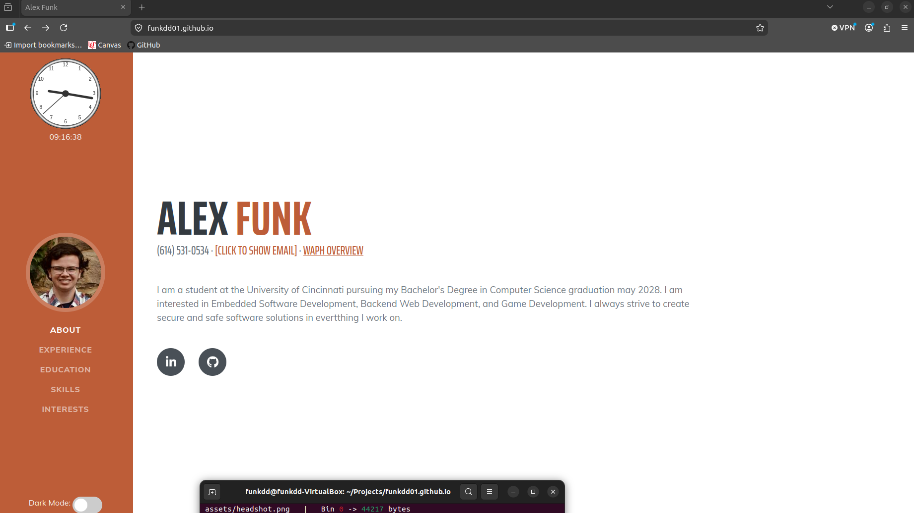
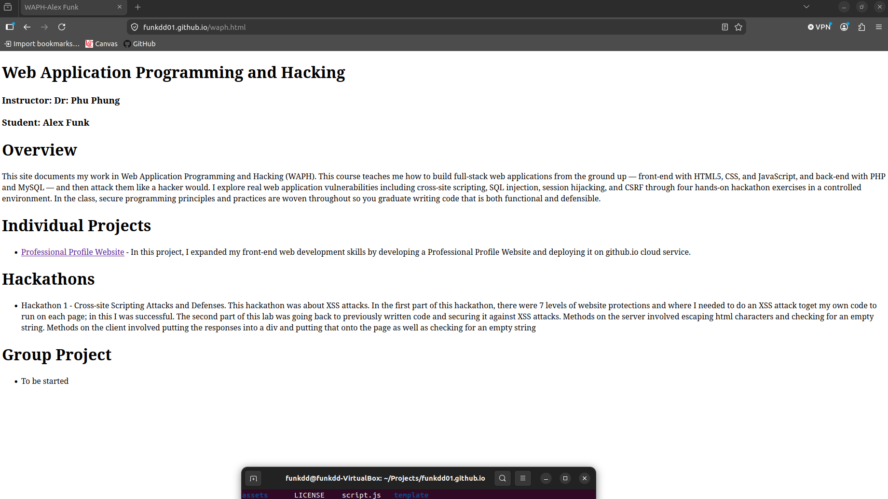
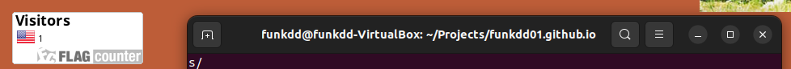
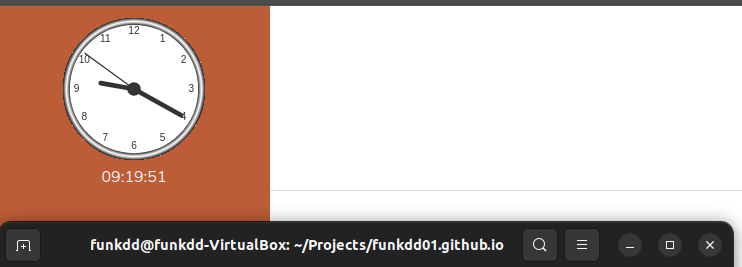
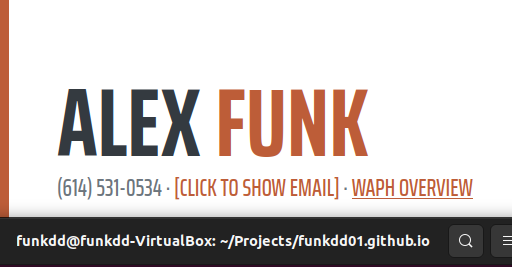
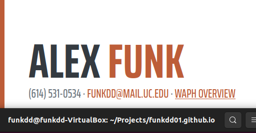
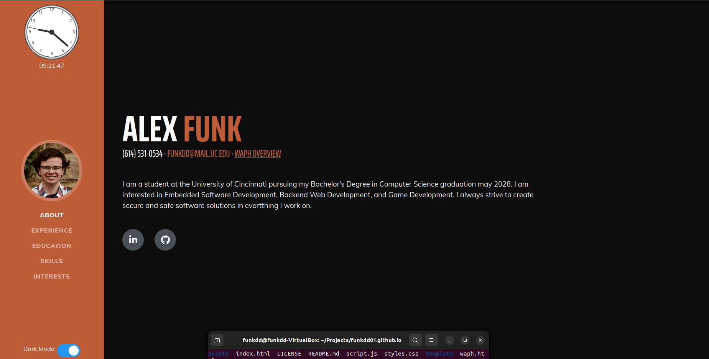
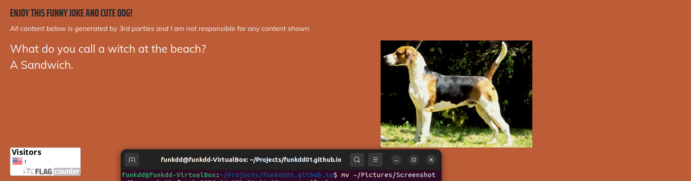
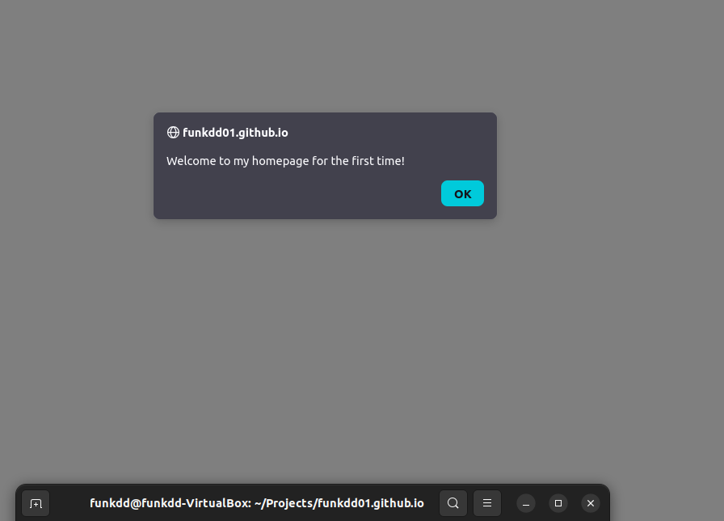
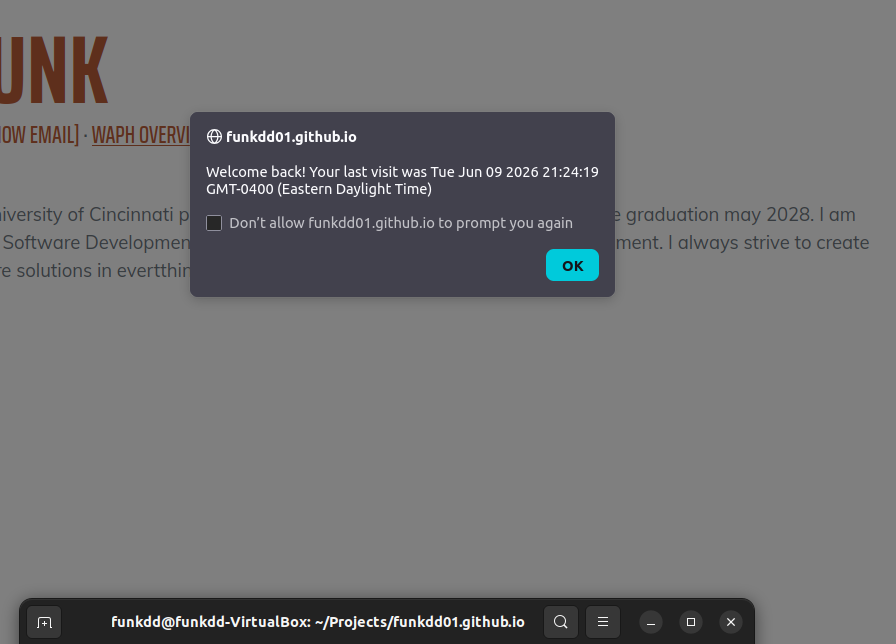

# WAPH-Web Application Programming and Hacking

## Instructor: Dr. Phu Phung

## Student

**Name**: Alex Funk

**Email**: [funkdd@mail.uc.edu](mailto:funkdd@mail.uc.edu)

**Short-bio**: Alex Funk is a Computer Science student at the University of Cincinnati 

# Project Writeup
## Overview

**Project Folder**: [github.com/funkdd01/funkdd01.github.io](https://github.com/funkdd01/funkdd01.github.io)  

**Deployed Site**: [funkdd01.github.io](https://funkdd01.github.io/)

This individual project was about utilizing front-end web devlopment techniques to create a professional portfolio website with many features. In this project, I needed to use an open-source CSS template, jQuery to add a bunch of mini features, integrate public APIs, etc.

## General Requirements
This section included adding my professional information to the page as well as linking to another page that gave an overview of the WAPH class. Adding my info was easy as all I had to do add the correct elements and type in the info correctly. The WAPH page was pretty similar except I had to add a link in the main page to get there. Overall, this section was simple.  
Here is the full page:  
  
And here is the waph page:  

## Non-Technical Requirements
This section included using an open-source CSS template or framework (Bootstrap for example) as well as implementing a page tracker to show where visitors of my page come from. For the CSS template, I found a [CSS template](https://startbootstrap.com/theme/resume) online that I liked, downloaded it, and added my own content to it. This template makes use of Bootstrap to function. For the page tracker, I went to [flagcounter.com](https://flagcounter.com), selected what parameters I wanted, and then copied the HTML it gave me and added it to my page. Overall, this task was also pretty simple.
Here is the page tracker in action:  

## Technical Requirements
This section was by far the most challenging to implement. In the first part of this section, I had to implement these various features:  

* A digital clock
* An analog clock
* Show/hide your email
* A dark mode toggle (the functionality of my choice)

See the following screenshots for where these functions exist on the page.
First here are the cloks. The analog clock is on top with the digital clock below it:  
  
Next, here is the email hidden:  
  
And then shown:  
  
Lastly, here is the page in dark mode (my custom functionality):  

The next part of this lab included integrating 2 public APIs. Both of the results of these APIs exist in the footer at the bottom of the page. The first API I integrated was the jokeAPI. This API returns a joke that I then format and display on the page. This joke also updates every minute. The second API used was a dog API to get images of dogs to display on the screen. This image is static and only changes when the user refreshes the page.  
Here are the APIs in action:  
  
The last part of this section was utilizing cookies to track if the user had visited the page before. If they hadn't, I would display a welcome message for new users. If the user had visited the page before, I would display a welcome message for returning users which inludes the date they last visited.  
Here is the popup when a user first visits it:  
  
And then each subsequent visit:  
